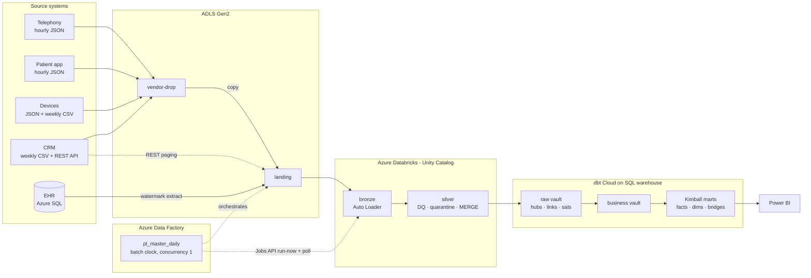

# TeleCare CH – Data Platform (ADF · Databricks · dbt Cloud)

[](https://github.com/Sarav-OR/telecare-data-platform/actions/workflows/ci.yml)

An end-to-end, production-style data platform for a **fictional Swiss telemedicine provider**
("TeleCare CH"). Five source systems are ingested every day by **Azure Data Factory**, validated and
standardised on **Azure Databricks** (Unity Catalog, Auto Loader, Delta), modelled as a
**Data Vault 2.0** and published as **Kimball star schemas** with **dbt Cloud**. Everything is
deployed from Git, tested on every pull request, and runs unattended.

All data is synthetic and generated by the repo itself. The company, people and partners are fictional;
code lists follow public standards (ICD-10-GM, ATC, Swiss cantons and holidays).

---

## At a glance

| | |
|---|---|
| **Sources** | 5 systems, 16 feeds: telephony events (JSON, hourly), patient app (JSON, hourly), clinical system / EHR (Azure SQL, 8 tables), CRM (CSV weekly + paginated REST API), device telemetry (JSON + weekly registry) |
| **Volume** | 90 days, 20,000 patients, ~135,000 encounters, ~600,000 call events, ~250,000 app events |
| **Ingestion** | ADF (metadata-driven, watermarks, batch clock) → Databricks landing → bronze → silver with a YAML data-quality engine, quarantine and circuit breaker |
| **Modelling** | dbt: 16 staging views → **raw vault** (12 hubs, 9 links, 3 non-historised links, 13 satellites) → **business vault** (3) → **Kimball** (16 dimensions, 3 facts, 2 bridges, 1 identity map) |
| **Tests** | 58 Python unit tests · 168 dbt data tests · 1 dbt unit test · 5 vault-vs-Kimball reconciliations · end-to-end CI run · incremental-equals-full-refresh proof |
| **Operations** | Unattended daily runs, failure alerts, run log, blocking freshness gate, CI/CD with branch protection |
| **Security** | Managed identities everywhere, no secrets in Git, PII restricted zone + Unity Catalog column mask, least-privilege grants as code |

## Architecture



| Layer | Tool | Responsibility |
|---|---|---|
| Orchestration | **ADF** | One pipeline per business date: copy files, extract the EHR incrementally, call the partner API, start and monitor the Databricks job, move the batch clock. Controlled by tables in `ctl` |
| Landing → silver | **Databricks** (Python package + Asset Bundle) | Auto Loader (`availableNow` micro-batches), typing, time-zone and unit harmonisation, declarative DQ rules, quarantine, dedupe, idempotent MERGE |
| Silver → marts | **dbt Cloud** | Data Vault 2.0 for integration and history; Kimball star schemas for analytics; tests, docs, CI |
| Serving | Databricks SQL warehouse → Power BI | Marts only; no PII beyond age bands |

## How a day runs (unattended)

```
ADF  pl_master_daily ── next business date from ctl.batch_state
      ├─ pl_copy_file_feeds    vendor-drop → landing   (feeds from ctl.file_feed; a missing delivery FAILS the run)
      ├─ pl_extract_ehr        8 tables, [watermark, date+1)  → Parquet; watermark moves only after the copy
      ├─ pl_copy_partner_api   Mondays: follows $.next links of the paginated API
      ├─ pl_run_databricks_job run-now with the ADF run id, poll every 60 s, fail unless SUCCESS
      └─ usp_complete_batch    clock +1 day (only if it is exactly the next day)   · any failure → ctl.run_log + rethrow
Databricks  setup_catalog → bronze (16 feeds) → silver (16 feeds, DQ)       ~15–20 min incl. cluster start
dbt Cloud   dbt source freshness (blocking) → dbt build (incremental)       ~4 min
```

The ADF run id travels into Databricks and is stored with every DQ metric and quarantined row, so any
silver row can be traced back to the orchestration run that loaded it.

## Data model: Data Vault → Kimball

**Why both:** the vault integrates five systems that disagree on keys and timing, keeps full history
and is insert-only (easy to load, easy to audit). Kimball marts on top give analysts simple,
fast star schemas. This mirrors a typical *vault-in-the-middle* migration.

| Vault pattern | Example |
|---|---|
| Hubs with a business-key collision code | keys from EHR / telephony / app never collide, even if the values look alike |
| Same-as link + identity business vault | `sal_patient` + `bv_patient_identity` resolve phone hash and app user to one patient |
| Multi-active satellite | `msat_encounter_diagnosis` (several diagnoses per encounter at the same time) |
| Effectivity satellite | `effsat_patient_coverage` (which insurance plan was valid when) |
| Non-historised links | `nhl_call_event`, `nhl_app_event`, `nhl_device_measurement` |
| Business vault | `bv_call_session`, `bv_app_session` (sessionisation, service level, outcome) |

| Fact | Grain | Key dimensions |
|---|---|---|
| `fact_encounter` | one medical consultation (accumulating snapshot) | patient (SCD2 via point-in-time), staff, service line, channel, triage, disposition, insurance plan, date, time · bridges to diagnoses and medications |
| `fact_contact` | one telephony or app contact session | queue, channel, outcome, patient, date, time · service level, abandonment |
| `fact_diagnostic_measurement` | one device measurement | device, metric, partner (pharmacy), patient, date |

SCD2 dimensions are derived from satellites; unknown members use key `-1`; facts load incrementally
with a 48-hour lookback for late-arriving data (proven equal to a full refresh in CI).

## Data quality

| Where | What |
|---|---|
| Ingestion (Python, `conf/dq_rules.yml`) | per-feed rules: not-null, regex, allowed values, ranges, expressions; **error** rows → `ops.quarantine`, **warn** rows kept and counted; per-rule metrics in `ops.dq_rule_results`; circuit breaker stops a feed above its error-rate threshold |
| Type drift | values Auto Loader rescues after a producer type change are cast back (`recover_type_drift`) |
| dbt | uniqueness, relationships, accepted values, SCD2 integrity (no gaps/overlaps), bridge weights sum to 1, **reconciliation vault ↔ facts**, a unit test for session logic |
| Freshness | `dbt source freshness` is a blocking step: stale silver means no new marts |

Result of the first automated day (16 Sep): every EHR extract matched the source change count exactly;
the difference between delivered and silver rows is fully explained by quarantined and duplicate rows.

## Security and governance

- **No secrets anywhere in Git or ADF**: ADF uses its managed identity for ADLS, Azure SQL and the Databricks Jobs API; CI secrets live in a GitHub environment.
- **Least privilege as code**: ADF may read `ehr` and execute `ctl` procedures only (`sql/ehr/02_grant_adf_read.sql`); it may *run* but not edit the Databricks job (`CAN_MANAGE_RUN` in the bundle).
- **PII**: date of birth lives only in the restricted ingestion zone (bronze/silver, tagged `pii`) and in the raw-vault satellite, where a **Unity Catalog column mask** shows it only to `pii_readers`. Marts expose ages and age bands only.

## CI/CD and environments

| Workflow | Trigger | Proves |
|---|---|---|
| `ci / lint-and-unit-tests` | every PR and push to `main` | ruff, 58 unit tests on local Spark, ADF JSON valid, wheel builds |
| `ci / end-to-end` | after the first job | generator → Spark ingestion → DuckDB → full dbt build and tests → incremental == full refresh (~4 min, no cloud cost) |
| dbt Cloud `telecare_ci` | every PR | changed models (`state:modified+`) build on Databricks in a throw-away schema |
| `deploy-databricks-dev` | merge to `main` (or manual) | the bundle validates and deploys without a laptop |

`main` is protected: pull request required, all checks green. ADF uses Git mode (`/adf`), publishing to `adf_publish`.
Environments: **dev** (built) and **prd** (designed: separate catalog, storage and service principal; see
`docs/setup/05_day4_cicd_guide.md`).

## Cost control

Single-node job cluster created per run (cluster policy enforces size, no Photon, auto-termination);
serverless SQL warehouse with 5-minute auto-stop; Azure SQL free offer with auto-pause; CI runs on
DuckDB and local Spark. A full simulated week costs a few CHF.

## Design decisions and trade-offs

| Decision | Alternative | Why |
|---|---|---|
| Micro-batch (`availableNow`) | continuous streaming | the sources deliver hourly/daily; minutes of latency meet the need at a fraction of the cost |
| Metadata-driven ADF + batch clock | one pipeline per source, trigger-time windows | new feed = one row; failed day is simply re-run; the clock never skips or repeats |
| Watermark extract from the EHR | CDC / change tracking | no change to the source system; limitation: intermediate versions between two extracts are not seen |
| Column mask on the vault, restricted zone for bronze/silver | mask everywhere | dedicated job clusters cannot read or MERGE masked tables |
| dbt triggered by schedule + freshness gate | ADF calls dbt Cloud API | Developer plan has no API; the gate prevents building on stale data |
| DuckDB for CI | CI against Databricks | free, fast, runs on every PR; cross-database macros keep one dbt project |

The full list of decisions and incidents, with the reasoning, is in [`docs/decision_log.md`](docs/decision_log.md).

## Evidence

Screenshots in [`docs/img/`](docs/img/): ADF master run with child pipelines, Databricks job run,
data-quality results, dbt Cloud production run (259/259), lineage graph, pull request with green checks,
PII mask demo.

## Repository map

| Folder | Content |
|---|---|
| `data_generator/` | synthetic 5-source generator, EHR loader, landing builder, API publisher, SQL script runner |
| `sql/` | EHR schema, ADF grants, orchestration control tables and procedures |
| `adf/` | Data Factory pipelines, datasets, linked services, trigger (Git mode) |
| `databricks/` | ingestion package, DQ engine and rules, Asset Bundle, cluster policy, tests |
| `dbt/` | staging, raw vault, business vault, marts, seeds, macros, tests, CI scripts |
| `.github/workflows/` | CI and deployment |
| `docs/` | data model specification, decision log, step-by-step setup guides (Day 1–4) |

## Run it locally (no cloud)

```bash
python -m venv .venv && . .venv/bin/activate
pip install -r requirements-dev.txt
python data_generator/generate.py --out ./work/telecare --days 30 --patients 4000 --contacts-per-day 400
python databricks/scripts/run_local_pipeline.py --generated ./work/telecare --out ./work/lakehouse
python dbt/scripts/load_silver_to_duckdb.py --lakehouse ./work/lakehouse --db ./work/ci.duckdb
cd dbt && DBT_DUCKDB_PATH=../work/ci.duckdb DBT_PROFILES_DIR=. dbt build --target ci
```

The cloud setup is documented step by step in `docs/setup/` (Azure foundation, Databricks, dbt Cloud,
ADF orchestration, CI/CD), including *why* each step exists and who owns it in a real team.
